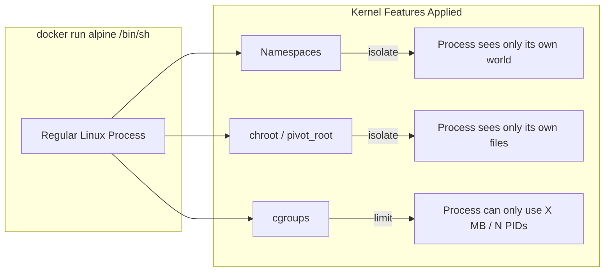
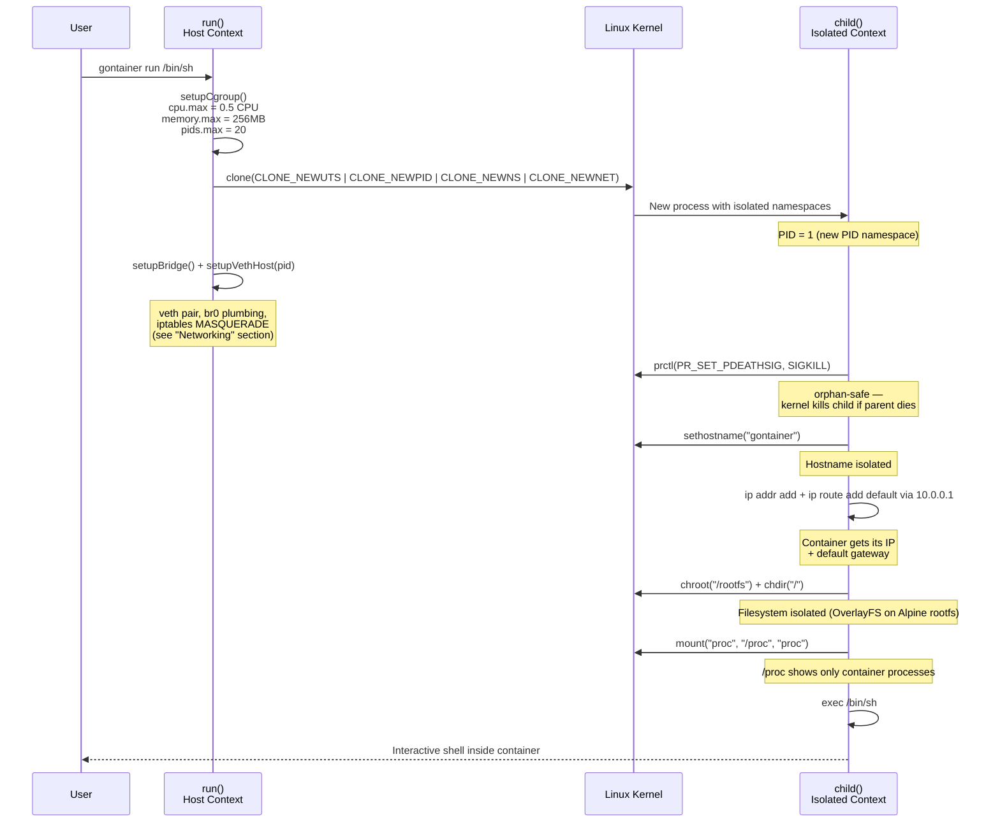
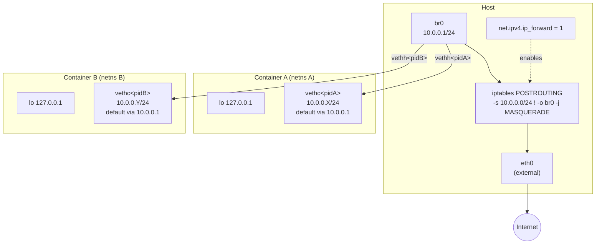

# gontainer

A minimal container runtime built from scratch in Go.

Learning project to understand what happens beneath `docker run` — namespaces, cgroups, and filesystem isolation.

## What Docker Actually Does

Docker containers are not virtual machines. They are regular Linux processes with **isolation** and **resource limits** applied using kernel features.



## Architecture



## Linux Kernel Features

### Namespaces — What can the process see?

| Namespace | Clone Flag | Isolates |
|---|---|---|
| UTS | `CLONE_NEWUTS` | Hostname |
| PID | `CLONE_NEWPID` | Process tree (container sees itself as PID 1) |
| Mount | `CLONE_NEWNS` | Mount points (`/proc` mount stays inside container) |
| Network | `CLONE_NEWNET` | Network stack — interfaces, routes, `iptables`, sockets, `/proc/net` |

### Filesystem — What files can the process access?

| Mechanism | Syscall | Effect |
|---|---|---|
| chroot | `syscall.Chroot("/rootfs")` | Root directory becomes Alpine rootfs |
| /proc mount | `syscall.Mount("proc", ...)` | Process info reflects PID namespace |
| OverlayFS | `syscall.Mount("overlay", ..., "lowerdir=/rootfs,upperdir=…,workdir=…")` | Copy-on-write — container writes land in a tmpfs upper layer, rootfs stays read-only |

### cgroups v2 — How much can the process use?

| Resource | File | Limit | Exceeded Behavior |
|---|---|---|---|
| CPU | `cpu.max` | 0.5 CPU (50ms/100ms) | Throttled (runs slower) |
| Memory | `memory.max` | 256 MB | OOM killed |
| Processes | `pids.max` | 20 | `fork()` returns EAGAIN |

### Networking — Who can the process talk to?

Each container gets its own network namespace. To give it reachability, `run()` plumbs a **veth pair** between the host and the container, attaches the host end to a shared **Linux bridge** (`br0`, `10.0.0.1/24`), and installs an **iptables MASQUERADE** rule so traffic leaving the bridge appears to come from the host's outbound interface.



| Piece | Command / File | Role |
|---|---|---|
| Bridge | `ip link add br0 type bridge` + `ip addr add 10.0.0.1/24 dev br0` | Central L2 hub + default gateway for all containers |
| veth pair | `ip link add vethh<pid> type veth peer name vethc<pid>` | Host ↔ container virtual cable |
| Move into ns | `ip link set vethc<pid> netns <pid>` | Push container end into the child's netns by PID |
| IP allocation | `(pid % 253) + 2` in the container | PID-derived IP to avoid collisions between concurrent containers |
| IP forwarding | `echo 1 > /proc/sys/net/ipv4/ip_forward` | Lets the kernel route packets between `br0` and the external interface |
| SNAT | `iptables -t nat -A POSTROUTING -s 10.0.0.0/24 ! -o br0 -j MASQUERADE` | Rewrites the source IP when packets leave the host, so the internet can reply |
| DNS | `echo "nameserver 8.8.8.8" > /etc/resolv.conf` (post-chroot) | Makes hostname lookups work inside the container |
| Lifecycle | `prctl(PR_SET_PDEATHSIG, SIGKILL)` in the child | If the parent dies unexpectedly, the kernel kills the child too — avoids orphan containers with stale netns |
| Cleanup | `defer ip link del vethh<pid>` + SIGINT/SIGTERM handler | Host-side veth is removed on any normal exit path |

## Docker Feature Mapping

| Docker CLI | Linux Kernel | gontainer |
|---|---|---|
| `--hostname X` | UTS namespace + `sethostname()` | `CLONE_NEWUTS` + `syscall.Sethostname()` |
| Process isolation | PID namespace + procfs | `CLONE_NEWPID` + `mount("proc")` |
| Mount isolation | Mount namespace | `CLONE_NEWNS` |
| Docker image | `chroot` / `pivot_root` | `syscall.Chroot("/rootfs")` |
| Copy-on-write layers | OverlayFS | `syscall.Mount("overlay", …, "lowerdir=/rootfs,upperdir=…,workdir=…")` |
| `--network bridge` (default) | netns + veth + bridge + `iptables` MASQUERADE | `CLONE_NEWNET` + `setupBridge()` + `setupVethHost()` |
| `--memory 256m` | cgroup `memory.max` | `WriteFile("memory.max", "268435456")` |
| `--cpus 0.5` | cgroup `cpu.max` | `WriteFile("cpu.max", "50000 100000")` |
| `--pids-limit 20` | cgroup `pids.max` | `WriteFile("pids.max", "20")` |

## Roadmap

### Step 1: Process Isolation (Namespaces)
- [x] Fork/exec child process with `CLONE_NEWUTS`, `CLONE_NEWPID`, `CLONE_NEWNS`
- [x] Set custom hostname inside container (UTS namespace)
- [x] Verify PID 1 inside container (PID namespace)

### Step 2: Filesystem Isolation (chroot)
- [x] Download and extract Alpine Linux minirootfs
- [x] `chroot` into rootfs
- [x] Mount `/proc` inside container

### Step 3: Resource Limits (cgroups v2)
- [x] Memory limit (256MB)
- [x] PID limit (fork bomb protection)
- [x] CPU limit (0.5 CPU)
- [x] Cleanup cgroups on container exit

### Step 4: Image Management
- [x] OverlayFS layer support (read-only base + writable upper)
- [ ] Simple `pull` command to fetch Alpine minirootfs

### Step 5: Networking
- [x] Network namespace (`CLONE_NEWNET`)
- [x] Create veth pair (`vethh<pid>` / `vethc<pid>`)
- [x] Set up bridge interface (`br0`, 10.0.0.1/24)
- [x] NAT for outbound traffic (`iptables MASQUERADE` + `ip_forward`)

### Step 6: Lifecycle hardening
- [x] Host-side veth cleanup on normal exit + SIGINT/SIGTERM
- [x] `PR_SET_PDEATHSIG` so an orphaned child is killed by the kernel — this also lets the kernel auto-remove both ends of the veth pair when the child's netns is torn down, so even `kill -9` on the parent leaves no lingering `vethh<pid>` interfaces

### Advanced — intentionally out of scope

gontainer deliberately stops at the kernel-boundary primitives. Each row below is a separate rabbit hole that production runtimes (runc, containerd, Docker, Podman) layer on top of this baseline. Listed here as signposts, not as a TODO.

| Topic | What it adds |
|---|---|
| **User namespace** | Maps UID/GID (root inside, unprivileged outside) — the core mechanism behind rootless containers |
| **pivot_root** | The more secure root switch runc uses (prevents escape via an open fd on the old root) |
| **seccomp** | Per-container syscall allowlist / denylist |
| **AppArmor / SELinux** | Mandatory access control profiles |
| **OCI image pull / registry** | Fetching and unpacking image layers from a registry — currently Alpine rootfs must be pre-extracted |
| **CNI-style pluggable networking** | The delegation boundary containerd sits on. Replaces the inline `iproute2` / `iptables` calls in this runtime with out-of-process plugins |
| **OCI runtime-spec + shim** | `config.json` compliance and a per-container supervisor process that decouples container lifetime from the daemon's |

## Prerequisites

- Docker (via colima, Docker Desktop, or similar)
- Go 1.25+

## Setup

```bash
# Start the development container
docker run --privileged --cgroupns=private -it -d \
  --name gontainer-dev \
  -v $(pwd):/app -w /app \
  golang:1.25 bash

# Download Alpine rootfs inside the container
docker exec gontainer-dev sh -c \
  'mkdir -p /rootfs && curl -sL https://dl-cdn.alpinelinux.org/alpine/v3.21/releases/aarch64/alpine-minirootfs-3.21.3-aarch64.tar.gz | tar xz -C /rootfs'

# Enable cgroup controllers (required once per container restart)
make setup-cgroup
```

## Usage

```bash
make build    # Build inside the container
make run      # Build and run (opens /bin/sh inside gontainer)
make shell    # Open a shell in the dev container
```

Inside gontainer:

```bash
hostname              # → gontainer (isolated)
ps aux                # → only container processes
ls /                  # → Alpine rootfs (not host)
cat /proc/self/cgroup # → /gontainer-<pid> (cgroup applied)
ip addr               # → only lo + vethc<pid>, no host NICs
ping -c1 10.0.0.1     # → bridge (host side) reachable
ping -c1 8.8.8.8      # → internet reachable via MASQUERADE
```

Start a second `make run` in another shell and the two containers can ping each other directly through `br0`.

## References

- [Liz Rice - Containers From Scratch (YouTube)](https://www.youtube.com/watch?v=8fi7uSYlOdc)
- [Linux namespaces(7)](https://man7.org/linux/man-pages/man7/namespaces.7.html)
- [cgroups(7)](https://man7.org/linux/man-pages/man7/cgroups.7.html)
- [chroot(2)](https://man7.org/linux/man-pages/man2/chroot.2.html)
- [OCI Runtime Spec](https://github.com/opencontainers/runtime-spec)

## License

MIT
