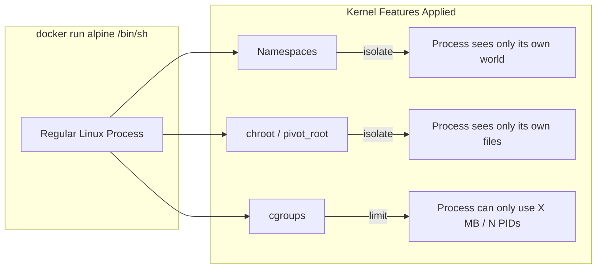
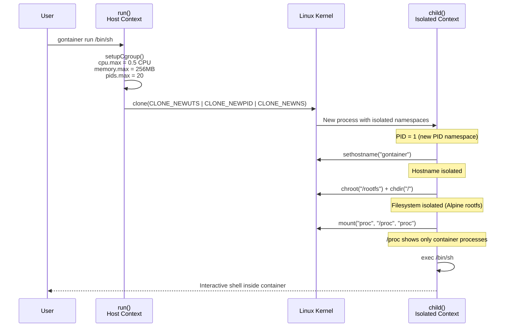
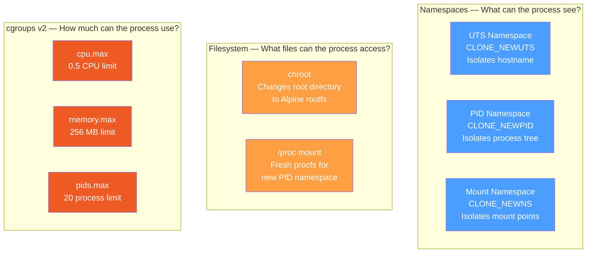

# gontainer

A minimal container runtime built from scratch in Go.

Learning project to understand what happens beneath `docker run` — namespaces, cgroups, and filesystem isolation.

## What Docker Actually Does

Docker containers are not virtual machines. They are regular Linux processes with **isolation** and **resource limits** applied using kernel features.



## Architecture



## Linux Kernel Features



## Docker Feature Mapping

| Docker CLI | Linux Kernel | gontainer |
|---|---|---|
| `--hostname X` | UTS namespace + `sethostname()` | `CLONE_NEWUTS` + `syscall.Sethostname()` |
| Process isolation | PID namespace + procfs | `CLONE_NEWPID` + `mount("proc")` |
| Mount isolation | Mount namespace | `CLONE_NEWNS` |
| Docker image | `chroot` / `pivot_root` | `syscall.Chroot("/rootfs")` |
| `--memory 256m` | cgroup `memory.max` | `WriteFile("memory.max", "268435456")` |
| `--cpus 0.5` | cgroup `cpu.max` | `WriteFile("cpu.max", "50000 100000")` |
| `--pids-limit 20` | cgroup `pids.max` | `WriteFile("pids.max", "20")` |

## Roadmap

### Step 1: Process Isolation (Namespaces)
- [x] Fork/exec child process with `CLONE_NEWUTS`, `CLONE_NEWPID`, `CLONE_NEWNS`
- [x] Set custom hostname inside container (UTS namespace)
- [x] Verify PID 1 inside container (PID namespace)

### Step 2: Filesystem Isolation (chroot)
- [x] Download and extract Alpine Linux minirootfs
- [x] `chroot` into rootfs
- [x] Mount `/proc` inside container

### Step 3: Resource Limits (cgroups v2)
- [x] Memory limit (256MB)
- [x] PID limit (fork bomb protection)
- [x] CPU limit (0.5 CPU)
- [x] Cleanup cgroups on container exit

### Step 4: Image Management
- [ ] OverlayFS layer support (read-only base + writable upper)
- [ ] Simple `pull` command to fetch Alpine minirootfs

### Step 5: Networking
- [ ] Network namespace (`CLONE_NEWNET`)
- [ ] Create veth pair
- [ ] Set up bridge interface
- [ ] NAT for outbound traffic

### What gontainer Does NOT Implement

| Feature | What it does |
|---|---|
| **Network namespace** | Isolates network stack (own IP, ports, routing) |
| **User namespace** | Maps UID/GID (root inside, unprivileged outside) |
| **pivot_root** | More secure alternative to chroot |
| **OverlayFS** | Copy-on-write image layers |
| **seccomp** | Syscall filtering |
| **AppArmor / SELinux** | Mandatory access control |

## Prerequisites

- Docker (via colima, Docker Desktop, or similar)
- Go 1.25+

## Setup

```bash
# Start the development container
docker run --privileged --cgroupns=private -it -d \
  --name gontainer-dev \
  -v $(pwd):/app -w /app \
  golang:1.25 bash

# Download Alpine rootfs inside the container
docker exec gontainer-dev sh -c \
  'mkdir -p /rootfs && curl -sL https://dl-cdn.alpinelinux.org/alpine/v3.21/releases/aarch64/alpine-minirootfs-3.21.3-aarch64.tar.gz | tar xz -C /rootfs'

# Enable cgroup controllers (required once per container restart)
make setup-cgroup
```

## Usage

```bash
make build    # Build inside the container
make run      # Build and run (opens /bin/sh inside gontainer)
make shell    # Open a shell in the dev container
```

Inside gontainer:

```bash
hostname              # → gontainer (isolated)
ps aux                # → only container processes
ls /                  # → Alpine rootfs (not host)
cat /proc/self/cgroup # → /gontainer (cgroup applied)
```

## References

- [Liz Rice - Containers From Scratch (YouTube)](https://www.youtube.com/watch?v=8fi7uSYlOdc)
- [Linux namespaces(7)](https://man7.org/linux/man-pages/man7/namespaces.7.html)
- [cgroups(7)](https://man7.org/linux/man-pages/man7/cgroups.7.html)
- [chroot(2)](https://man7.org/linux/man-pages/man2/chroot.2.html)
- [OCI Runtime Spec](https://github.com/opencontainers/runtime-spec)

## License

MIT
